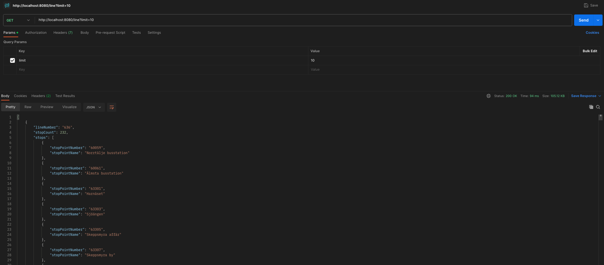
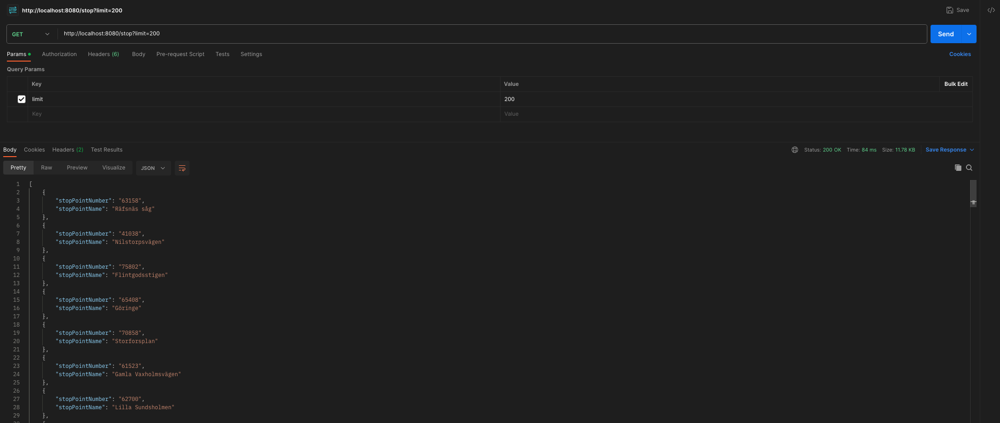

# trafiklab

This is a simple app that uses the Trafiklab API to display some information about the Stockholm public transport
system.


## Tech/Framework Used

- Java 17
- Spring Boot
- Spring WebFlux
- Maven
- Redis


## Features

- Displaying bus lines and their stops


## Installation

1. Clone the repository

```bash
git@github.com:serdarburakguneri/trafiklab.git
```


2. cd into the directory

```bash
cd trafiklab
```


3. Compile the project

```bash
mvn clean compile
```


4. The app uses a Redis cache. You can use the following command to start a Redis container if you don't have
   any installed on your machine:

```bash
cd docker

docker-compose up
```

Requirements:

You need to have Docker daemon running on your machine.

Additionally, you need to have Docker Compose installed. You may
install it from [here](https://docs.docker.com/compose/install/)

By modifying the `docker-compose.yml` file, you can change the redis port and data volume. Be sure to modify
the `application.properties` file accordingly.

Ensure that you are not using a port that is already in use. The docker compose file currently maps the redis port to '6389'.


5. Modify the `application.properties` file to match your redis and trafiklab api configuration.

For redis, the default configuration is:

```properties

# Redis properties
spring.data.redis.host=localhost
spring.data.redis.port=6389

```

For the Trafiklab API, you need to obtain an API key from [Trafiklab](https://www.trafiklab.se/)

The api url is pointing to the [stops and lines](https://www.trafiklab.se/api/trafiklab-apis/sl/stops-and-lines-2/) API
endpoint.

```properties

# Trafiklab API properties
trafiklab.api.key=<your-api-key>
trafiklab.api.url=https://api.sl.se/api2/LineData.json

```

You can find the json files that are fetched from the Trafiklab API in the `data` directory. You may change
the directory by modifying the following properties:

```properties 
# File properties for storing data
trafiklab.data.stop.filepath=data/stops.json
trafiklab.data.journey.filepath=data/journeyPattern.json
trafiklab.data.line.filepath=data/line.json
```

By default, the application tries to sync the data by reading the files from the `data` directory. If you want to
disable
this feature, you may set the following property to `false`:

```properties
trafiklab.data.sync-on-start=false
```

Additionaly, if you want to fecth the real data from the Trafiklab API, you may set the following property to `true`:

```properties 
trafiklab.data.fetch-from-api=true
```

You may also want to change the port that the app is running on. The default port is 8080.

```properties  
server.port=8080
```


6. Run the app

```bash
mvn spring-boot:run
```

Regarding your configuration, the app will start and fetch the data from the Trafiklab API and save it to the json files
in the `data` directory. Then, it will read the data from the files and save it to the Redis cache.


## Viewing the lines and stops

http://localhost:8080/line endpoint will display the bus lines and their stops. It orders the lines by their stop
counts.

You may use a REST client like Postman to make a GET request to this endpoint.

Alternatively, you may use the following command to make a GET request to the endpoint:

```bash
curl -i http://localhost:8080/line
```  

To save the response to a file, you may use the following command:

```bash
curl -i http://localhost:8080/line -o result.json
```

By default, it fetches 10 lines and their stops. You may change the number of lines to be fetched by modifying
the `limit`
query parameter.

```bash
curl -i http://localhost:8080/line?limit=5
```

An example output is like;




## Viewing a single line and its stops

http://localhost:8080/line/{lineNumber} endpoint will display the stops of the line with the given line number.

```bash
curl -i http://localhost:8080/line/505
```

An example output is like;

HTTP/1.1 200 OK
Content-Type: application/json
Content-Length: 2397

```json
{"lineNumber":"515","stopCount":40,"stops":[{"stopPointNumber":"10345","stopPointName":"Odenplan"},{"stopPointNumber":"10547","stopPointName":"Stadsbiblioteket"},{"stopPointNumber":"10549","stopPointName":"Frejgatan"},{"stopPointNumber":"10551","stopPointName":"Sveaplan"},{"stopPointNumber":"10553","stopPointName":"Norrtull"},{"stopPointNumber":"50005","stopPointName":"Haga södra"},{"stopPointNumber":"50304","stopPointName":"Sundbybergs station"},{"stopPointNumber":"50308","stopPointName":"Sundbybergs skola"},{"stopPointNumber":"50348","stopPointName":"Vasalund"},{"stopPointNumber":"50350","stopPointName":"Dalvägen"},{"stopPointNumber":"50352","stopPointName":"Solna station"},{"stopPointNumber":"50354","stopPointName":"Kolonnvägen"},{"stopPointNumber":"50403","stopPointName":"Råsunda"},{"stopPointNumber":"50405","stopPointName":"Uppfartsvägen"},{"stopPointNumber":"50407","stopPointName":"Näckrosen"},{"stopPointNumber":"50409","stopPointName":"Bokvägen"},{"stopPointNumber":"50435","stopPointName":"Tuletorget"},{"stopPointNumber":"50437","stopPointName":"Sundbybergs idrottsplats"},{"stopPointNumber":"51861","stopPointName":"Stationsgatan"},{"stopPointNumber":"52318","stopPointName":"Haga norra"},{"stopPointNumber":"10550","stopPointName":"Frejgatan"},{"stopPointNumber":"10552","stopPointName":"Sveaplan"},{"stopPointNumber":"10554","stopPointName":"Norrtull"},{"stopPointNumber":"10798","stopPointName":"Odenplan"},{"stopPointNumber":"50006","stopPointName":"Haga södra"},{"stopPointNumber":"50010","stopPointName":"Haga norra"},{"stopPointNumber":"50148","stopPointName":"Kolonnvägen"},{"stopPointNumber":"50305","stopPointName":"Stationsgatan"},{"stopPointNumber":"50349","stopPointName":"Vasalund"},{"stopPointNumber":"50351","stopPointName":"Dalvägen"},{"stopPointNumber":"50404","stopPointName":"Råsunda"},{"stopPointNumber":"50406","stopPointName":"Uppfartsvägen"},{"stopPointNumber":"50408","stopPointName":"Näckrosen"},{"stopPointNumber":"50410","stopPointName":"Bokvägen"},{"stopPointNumber":"50434","stopPointName":"Solna station"},{"stopPointNumber":"50436","stopPointName":"Tuletorget"},{"stopPointNumber":"50438","stopPointName":"Sundbybergs idrottsplats"},{"stopPointNumber":"50439","stopPointName":"Sundbybergs station"},{"stopPointNumber":"50440","stopPointName":"Sundbybergs skola"},{"stopPointNumber":"50443","stopPointName":"Stadsbiblioteket"}]}
```


## Viewing all the stops

http://localhost:8080/stop endpoint will display all the stops.

```bash
curl -i http://localhost:8080/stop
```

An example output is like;




## Tests

You may run the tests with the following command:

```bash
mvn clean test
```

There are some unit tests and integration tests in the project.

The integration tests are using the `Testcontainers` library to start a Redis container and run
the tests against it.


## Challenges & Missing Parts And Possible Improvements

- The data fetched from Trafiklab is large. Therefore, we should either increase the buffers and timeouts of web clients
  or
  read the data as a stream.

  My choice was to fetch the data as a stream, save it in a file to be sure that the data is fetched properly and then
  read the file as chunks and
  save it to the cache in a reactive way.

- My first choice for persisting the data was a postgres database since it's a relational data. But I decided to use
  Redis since the data is not updated frequently, and the relations are not so complicated. If we think that we may
  have more tables and complex relations, we may switch to a relational database.

- Currently, I am not removing the data that is not present Trafiklab API response. (They may remove stops for example)
  But I believe that with a good cache eviction policy, we may handle this problem. For example, we may get the data
  everyday to be in sync with the Trafiklab API. By having a TTL for the records in the cache, we may remove the old
  records. This means, unless we get them from the Trafiklab API, they will no longer be served to the clients.

- I tried spring reactive for the first time so I may have some mistakes in the code especially for exception handling.

- For a real time application, CQRS may be a good choice. We may have an application that is responsible for fetching
  the data from the Trafiklab API and storing it in the Redis cache.
  Then, we may have another application that is responsible for serving the data to the clients. This way, we may scale
  the read and write operations independently. 

  
